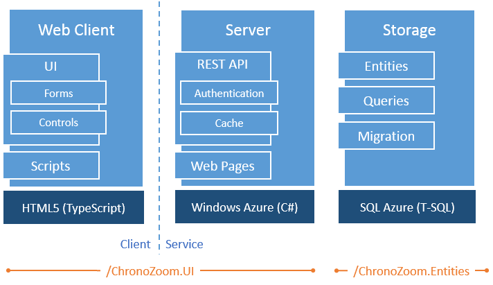

<h1>ChronoZoom Architecture</h1>

## Overview ##

ChronoZoom is composed of a web application and a service built on HTML5 and Microsoft .NET hosted in Windows Azure and SQL Azure. The client is written in TypeScript, the server in C# and the storage schema and logic in T-SQL.

The ChronoZoom client interacts with the ChronoZoom service through a [REST API](https://github.com/alterm4nn/ChronoZoom/blob/master/Doc/ChronoZoom_REST_API.md "REST API") to perform all [run-time](https://github.com/alterm4nn/ChronoZoom/blob/master/Doc/User_Guide.md "run-time") and [authoring](https://github.com/alterm4nn/ChronoZoom/blob/master/Doc/ChronoZoom_Authoring_Guide.md "authoring") operations.

The following diagram depicts the high-level architecture:

----------

## Contents ##

[Client Architecture](#client-architecture)

[Server Architecture](#server-architecture)

[Storage Architecture](#storage-architecture)

----------

## Client Architecture ##

## Server Architecture ##

## Storage Architecture ##
