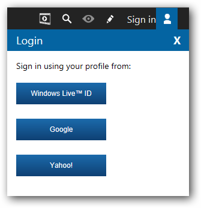
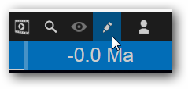
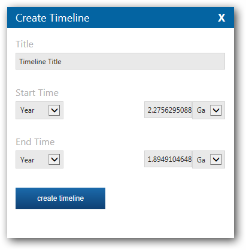
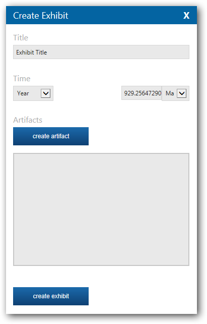
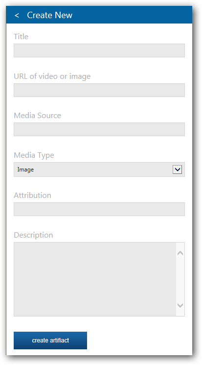
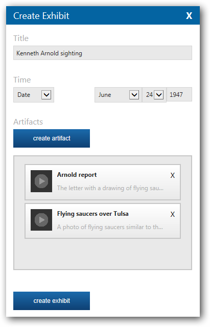

<<<<<<< HEAD
# ChronoZoom Authoring Guide #
This guide shows you all you need to know to make your own custom ChronoZoom timelines and exhibits.

See also: [ChronoZoom User Guide](http://join.chronozoomproject.org/user-guide/ "ChronoZoom User Guide")

## Contents ##
- [Get Started](#get-started)
- [Research and Planning](#research-and-planning)
- [Create a Timeline](#create-a-timeline)
- [Create an Exhibit](#create-an-exhibit)

## Get Started ##
Before you start, you will need to sign in using either a Windows Live&#8482;, Google, or Yahoo! user account. If you have not created a ChronoZoom account, you will be prompted to do so.

## Research and Planning ##
Doing a bit of research and planning will make creating content in ChronoZoom a more enjoyable experience. During this phase, you will get to spend some time learning about history! As your research progresses, you might find it helpful to create a spreadsheet to track the items you want to cover. The following example spreadsheet shows a list of exhibits for a proposed timeline documenting the UFO phenomenon beginning in 1947 with the famous sighting that gave us the term "Flying Saucer". Each sheet represents the exhibits that are associated with a particular timeline or collection.

[UFO_Phenomenon_Timeline_Priorities.xlsx](UFO_Phenomenon_Timeline_Priorities.xlsx)

## Create a Timeline ##
A timeline is a visual representation of a time period. Timelines can contain other (child) timelines, and exhibits. You can use timelines to depict a range of time such as the lifespan of a historical figure or period of a civilization.

**To create a timeline**
1. Click the pencil icon to enter authoring mode. Enter your credentials and sign in if prompted.

2. Zoom in to the regime that is the most appropriate for the length of the timeline you are creating (Cosmos, Earth, Life, Prehistory, Humanity).
3. Click the **create timeline** button.
4. Position your cursor near the point you would like the timeline to begin, then click and drag to create the timeline. 
    The **Create Timeline** dialog appears.

5. Enter a title in the **Title** field.
6. Select a start time and a [time unit](http://paleontology.wikia.com/wiki/Annum). Start times can be defined either as a year, or as a specific date. Time units can be one of the following:

|Unit|Abbreviation|Value|
|:---|:-----------|:----|
|Giga-annum|Ga|one billion years|
|Mega-annum|Ma|one million years|
|Kilo-annum|Ka|one thousand years|
|Before Common Era|BCE|The period prior to Julian Era 1|
|Common Era|CE|The period after Julian Era 1|

7. Select an end time and a time unit. End times can be defined either as a year, a specific date, or infinite.
8. Click **create timeline** to create the timeline.

## Create an Exhibit ##
An exhibit consists of a set of content items (artifacts), and is contained by either a timeline or a collection. Content items can be one of the following types:
- Image
- PDF
- Audio
- Video

**To create an exhibit**
1. Click the pencil icon to enter authoring mode. Enter your credentials and sign in if prompted.

2. Zoom in to the regime that is the most appropriate for the length of the exhibit you are creating (Cosmos, Earth, Life, Prehistory, Humanity).
3. Locate the timeline with which the exhibit should be associated.
4. Click the **create exhibit** button, then click on the area where you would like to create the exhibit. The **Create Exhibit** dialog will appear.

5. Click **create artifact** to associate a new content item with the exhibit. Each exhibit must have at least one artifact.

6. Click **create artifact** to add the content item. The exhibit will list the artifacts that have been created:

7. Click **create exhibit** to create the exhibit.
=======
# ChronoZoom Authoring Guide #
Now you can create your own timelines and exhibits to take users on new historical journeys.

## Create a Timeline ##

## Create an Exhibit ##
>>>>>>> 9d728ff... Added more screen captures; text updates.
