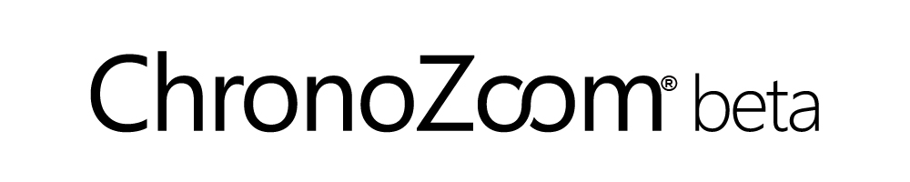

<h1>Developer's Guide</h1>

## Introduction ##

ChronoZoom is an open source community project dedicated to visualizing Big History that has been funded and supported by Microsoft Research Connections in collaboration with University California at Berkeley and Moscow State University.

You can browse through history on ChronoZoom to find data in the form of articles, images, video, sound, and other multimedia. ChronoZoom links a wealth of information from five major regimes that unifies all historical knowledge collectively known as Big History.

This guide covers everything you need know to install the ChronoZoom development environment tools, use GitHub to get ChronoZoom source code, and deploy ChronoZoom to an Azure hosted website.

If you are new to GitHub, we recommend reading [Learning to use GitHub for ChronoZoom development](/../LearningTouseGithub.md/) for more information on setting up your source code repository.

<!-- Note: Some of the APIs for ChronoZoom are not yet available for the public. -->

----------

## Contents ##

<a href="#install">Install the ChronoZoom Development Environment Tools</a> 
<a href="#ssh">Generate an SSH Key for GitHub Authentication</a> 
<a href="#clone">Clone the ChronoZoom GitHub Repository</a> 
<a href="#deploy">Deploy ChronoZoom to Azure</a> 
<a href="#guidelines">Contributing Guidelines</a> 
<a href="#future">The Future of ChronoZoom</a> 
<a href="#disclaimer">Disclaimer</a> 

----------

##  Install the ChronoZoom Development Environment Tools ##

### Minimum Requirements ###
- [Visual Studio 2012 Ultimate](http://www.microsoft.com/visualstudio/eng/products/visual-studio-overview) or [Visual Studio Express for Web](http://www.microsoft.com/visualstudio/eng/products/visual-studio-express-for-web)
- [Visual Studio 2012.2 CTP 3](http://www.microsoft.com/en-us/download/details.aspx?id=36539)
- [Visual Studio Tools for Git](http://visualstudiogallery.msdn.microsoft.com/abafc7d6-dcaa-40f4-8a5e-d6724bdb980c)
- [Git for Windows](http://code.google.com/p/msysgit/downloads/list?q=full+installer+official+git)
 - Be sure to select 'Run Git from the Windows Command Prompt' during installation.
- [Stylecop](http://stylecop.codeplex.com/)

### Recommended ###
- [Beyond Compare](http://www.scootersoftware.com/moreinfo.php)
 - [Using Beyond Compare with Git](http://www.scootersoftware.com/support.php?zz=kb_vcs)
- [Markdown Pad for Windows](http://markdownpad.com/)
- [Web Essentials 2012](http://visualstudiogallery.msdn.microsoft.com/07d54d12-7133-4e15-becb-6f451ea3bea6)
- [Jetbrains Resharper](http://www.jetbrains.com/resharper)
 - [Free license for open source development](http://www.jetbrains.com/eforms/openSourceRequest.action?licenseRequest=RSOSL)

### Optional ###
- [Web Platform Installer](http://www.microsoft.com/web/downloads/platform.aspx)
- [SQL Server Express 2012 SP1 with Tools](http://www.microsoft.com/en-us/download/details.aspx?id=35579)
 - Use Mixed Mode Authentication, Azure doesn't support Integrated Mode security
- Internet Information Server
- [Azure SDK for .NET](http://www.windowsazure.com/en-us/develop/downloads/)

## Generate an SSH Key for GitHub Authentication ##
You can use SSH keys to establish a secure connection between your computer and GitHub. This is an alternative to cloning an HTTPS repository URL. The following example shows using the ssh-keygen utility to generate a new key, and then using the **clip** command to copy the key to the clipboard.

`ssh-keygen -t rsa -C "youremail@server.com" -f %userprofile%\.ssh\id_rsa`
`clip < %userprofile%\.ssh\id_rsa.pub`

Once this is done you can add the SSH key to GitHub. For more detailed information, see [Generating SSH Keys](https://help.github.com/articles/generating-ssh-keys).

## Clone the ChronoZoom GitHub Repository ##
In order to get the source for ChronoZoom, you will need to clone the GitHub repository. Before doing so, be sure that you have installed [Git for Windows](http://code.google.com/p/msysgit/downloads/list?q=full+installer+official+git).

1. Go to: [https://github.com/alterm4nn/ChronoZoom](https://github.com/alterm4nn/ChronoZoom). This is the master branch for the project.
1. Clone this branch on your local computer.
- Open the Git shell and run the following commands:
        - `git clone git@github.com:alterm4nn/ChronoZoom.git`
        - `cd ChronoZoom`
    
    You now have your own fork of the ChronoZoom project.

1. Create a working branch by using the following command:   
    `git checkout -b branch_name`
    
    Make all of your changes in this branch, and consider the master branch to be an "untouched" master that can be updated to get the latest changes with `git pull`.

For more information, see [Git Basics - Getting a Git Repository](http://git-scm.com/book/en/Git-Basics-Getting-a-Git-Repository).

## Deploy ChronoZoom to Azure ##
To test your changes, you will need to deploy ChronoZoom to Azure.

### Add a New Website ###

Login to [Azure Management Portal](https://manage.windowsazure.com).

At the bottom of the page, click the **+ NEW** bar and select the following options:

**Compute** -> **Web Site** -> **Custom Create** -> **Create Web Site**

In the **Create Web Site** dialog, fill in the fields as follows:

- **Url**: Enter a name for your website (in this example the website name is ***mycz***).
- **Region**: Leave the default value.
- **Database**: Select the **Create New Sql Database** option.
- **DB Connection String Name**: Enter "Storage" (omit quotation marks).
- **Publish from Source Control**: Checked
- Click the arrow icon to go to page 2.
	
### Specify Database Settings ###

Fill in the fields as follows:

- **Server**: Select **New SQL Database server**. It's okay to select a pre-existing database if you have already created one.
- **Login name**: Enter the user name for the database. In this example the user name is ***myDatabaseUsername***.
- **Password**: Enter the password for the database. In this example the password is ***myDatabasePassword***.
- Click the arrow icon to go to page 3.
	
### Specify Source Control Settings ###

- **Source Control Type**: Select **Git**.
- **Repository Location **: Select **Local Repository**.
	- It is possible to set up continuous replication from GitHub here, however this example uses a local repository for simplicity.
- Click the arrow icon to go to page 4.
	
### New user name and password (for Git) ###

- **Username**: Enter a user name for Git. In this example it is ***myGitUsername***.
- **Password**: Enter a password for Git. In this example it is ***myGitPassword***.
	
### Go to Dashboard for Web Site ###

- Copy the Git Clone Url. It will be listed under **quick glance** in the right column, and will be something like: *https://***myGitUsername***@***mycz***.scm.azurewebsites.net/***mycz***.git*

### Get a local copy of the ChronoZoom source code ###

Open the Git command prompt and clone the main ChronoZoom repository as follows:

- git clone git@github.com:alterm4nn/ChronoZoom.git
- cd ChronoZoom

### Add a connection to the Azure Web Site ###

- git remote add azure https://***myUsername***@***mycz***.scm.azurewebsites.net/***mycz***.git

Now you can make changes to the source code.

### Publish your changes to the Azure Web Site ###
Open the Git command prompt and use the following command. You will be prompted for your Azure deployment credentials.

- git push --set-upstream azure master
 
### Preview Your Site! ###

Browse to http://***[myUsername]***.azurewebsites.net/ and behold your own copy of ChronoZoom! Your site URL is listed in the **quick glance** column of the Azure dashboard.

## Contributing Guidelines ##

- Prior to making a pull request, be sure to apply the latest changes from master to your working branch.
- Add meaningful comments when you make your commits.
- Use the project's coding style, not your own. Follow the existing code as an example of what to do.
- Use [Stylecop](http://stylecop.codeplex.com/) to ensure that your code is conformant with project style.

## The Future of ChronoZoom
We envision a world where scientists, researchers, students, and teachers collaborate through ChronoZoom to share information via data, tours, and insight.

Imagine a world where the leading academics publish their findings to the world in a manner that can easily be accessed and compared to other data.

Imagine a tool that allows teachers to generate tours specific to their classroom needs.

This can happen with your support.   As ChronoZoom through the beta release, we need your feedback and support to continue to mold this project to suit your needs.

Help ChronoZoom evolve by taking this survey so we can provide the best possible future features: [http://www.zoomerang.com/Survey/WEB22EFZBLQL4B/](http://www.zoomerang.com/Survey/WEB22EFZBLQL4B/)

---------

## Disclaimer ##
This document is provided "as-is". Information and views expressed in this document, including URL and other Internet Web site references, may change without notice. You bear the risk of using it.

This document does not provide you with any legal rights to any intellectual property in any Microsoft product. You may copy and use this document for your internal, reference purposes.

&copy; 2013 The Outercurve Foundation.

Distributed under Creative Commons Attribution 3.0 Unported License.

Microsoft, Visual Studio, and Windows are trademarks of the Microsoft group of companies.  All other trademarks are property of their respective owners.
