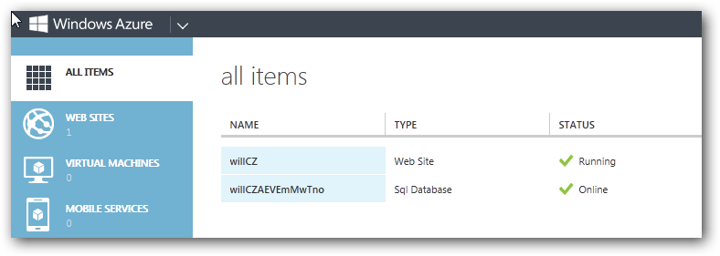
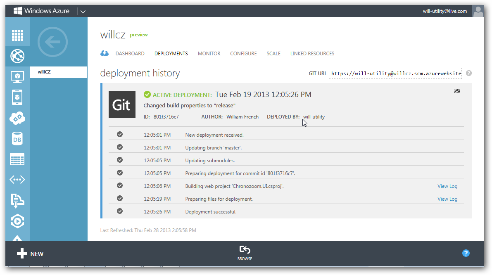
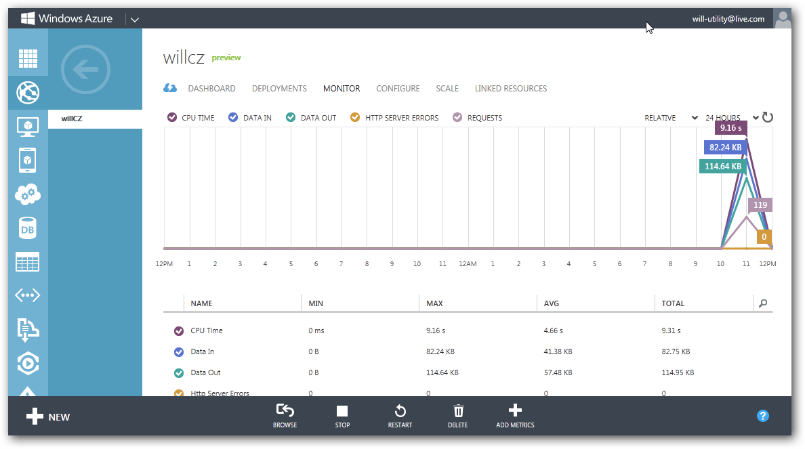
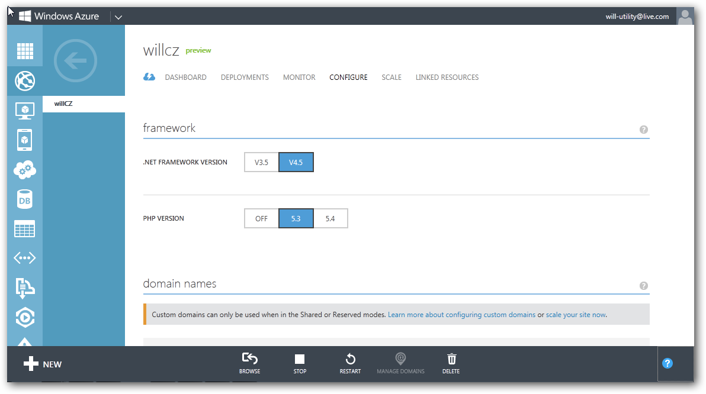
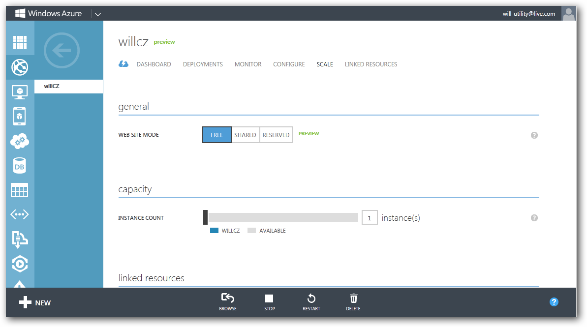
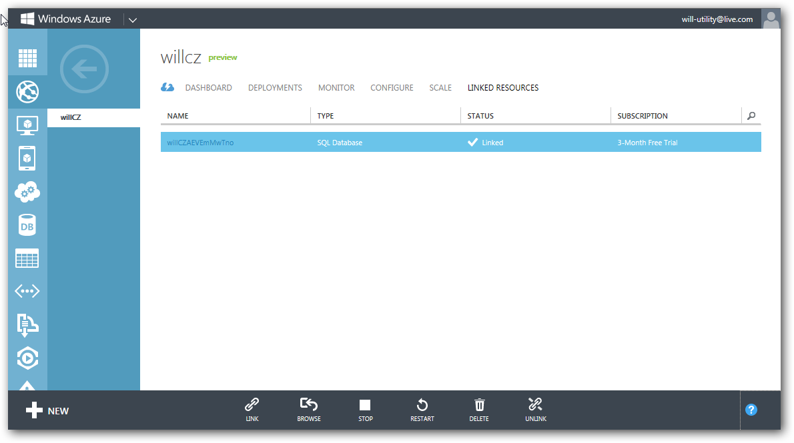

# ChronoZoom Operations Guide #
You can use the [Azure Management Portal](https://manage.windowsazure.com/) to configure and monitor your ChronoZoom site (and any other sites or resources that you have created on Azure). This guide summarizes the most common tasks that you will need to perform on Azure, and contains links to more detailed information where appropriate.

When you first sign in to Azure, you are presented with a list of resources. The Web site that you are using to host ChronoZoom should appear within this list along with the associated SQL database.

Along the bottom of the page are several options: **New**, **Browse**, **Stop**, **Restart**, **Manage Domains**, **Delete**, and **Help**. Clicking the **Help** icon will display help content for whichever tab you are currently working in. The contents of the bottom bar will change depending on the tab you are in.

Click the name of your Web site to bring up the dashboard tab. Here you can see all of the usage statistics for the site, as well as other useful information such as connection strings, URLs, FTP host name, and more.

Click **DEPLOYMENTS** to view the deployment history for your site.

Click **MONITOR** to view real-time Web metrics for your site.

Click **CONFIGURE** to access the Web site configuration options tab. Here you can change web application specific settings, the type and level of diagnostic logging that is employed and any alternative hostnames used to connect to the web site.

Click **SCALE** to bring up the SCALE tab. Here you can modify scale options to give a Web site additional load capacity and/or fault tolerance.

Click **LINKED RESOURCES** to see all of the resources that your Web site is dependent upon. At the start, you should see only your SQL database. Note that you can scale the capacity of your SQL database on the **SCALE** tab for your Web site.

