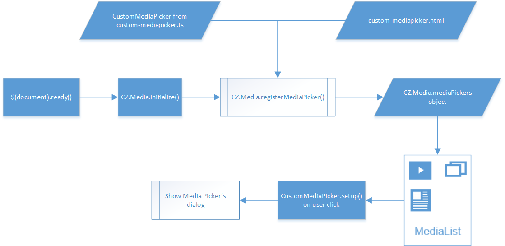

# Getting started with Media Pickers #

**Media Picker** is a control, which allows a user to pick media resource from external service like Bing or SkyDrive. **Media List** is a control, which shows icons of all registered media pickers and allows a user to open any registered media picker. This guide shows how to implement your own media picker and add it in media list control, which is used in **Edit Content Item** dialog of ChronoZoom.

##Overview##

ChronoZoom provides convenient mechanism for registration of new media pickers. All you need is to add `.ts` and `.html` files with media picker's class and view. Then you need to register new media picker in `CZ.Media.initialize()` function ([/scripts/media.ts](../Source/Chronozoom.UI/scripts/media.ts)). After registration media list control automatically picks your media picker and shows its icon in the list. The following diagram shows this data flow:



On the diagram you need to provide `custom-mediapicker.ts` and `custom-mediapicker.html` files. `CustomMediaPicker` class must contain static `setup()` method. This method is a handler for media picker's icon in media list control.

##Create custom media picker##

Follow the next steps to add your media picker in ChronoZoom:

1. Add an icon for new media picker in [/images/media/](../Source/Chronozoom.UI/images/media/) directory.

2. Add `.ts` and `.html` of new media picker in [/ui/media/](../Source/Chronozoom.UI/ui/media/) directory.

3. Open [/scripts/media.ts](../Source/Chronozoom.UI/scripts/media.ts) file and register your media picker in `CZ.Media.initialize()` function using `CZ.Media.registerMediaPicker()` function. Media list control displays icons in order of registration. For registration you need to provide a title, URL of icon, URL of `html` file with media picker's view, a class of media picker from `.ts` file. E.g.:
```
    registerMediaPicker(
        "bing",
        "/images/media/bing-icon.png",
        "/ui/media/bing-mediapicker.html",
        CZ.Media.BingMediaPicker
    );
```
You can also pass `selector` parameter to `registerMediaPicker()` function if you wish to load your media picker's view in a specific DOM element.

4. You can always get information about media pickers from the following objects using title of media picker:
```
    CZ.Media.mediaPickers[title]; // returns object of type CZ.Media.MediaPickerInfo from /scripts/media.ts
    CZ.Media.mediaPickersViews[title]; // returns JQuery object with media picker's view
```

5. Write your code in new added files. `.ts` file must contain a class with your media picker, which you passed to registration function. Static `setup()` method of the class is required:  
```
    public static setup(context) {
        // your setup code here...
    }
```
Here `context` is an artifact which passed from **Edit Content Item** dialog. Media picker updates artifact's media properties when a user selects media resource. You can use object of type `CZ.Media.MediaInfo` to store temporary information about media resource and then use this object to update artifact.

##Samples##

If you need more information about how to implement your own media picker, please refer to the sample in the [/samples/custom-mediapicker/](../Source/Chronozoom.UI/samples/custom-mediapicker/) directory.

Or you can refer to existent Bing media picker:  
[/ui/media/bing-mediapicker.ts](../Source/Chronozoom.UI/ui/media/bing-mediapicker.ts)  
[/ui/media/bing-mediapicker.html](../Source/Chronozoom.UI/ui/media/bing-mediapicker.html)
