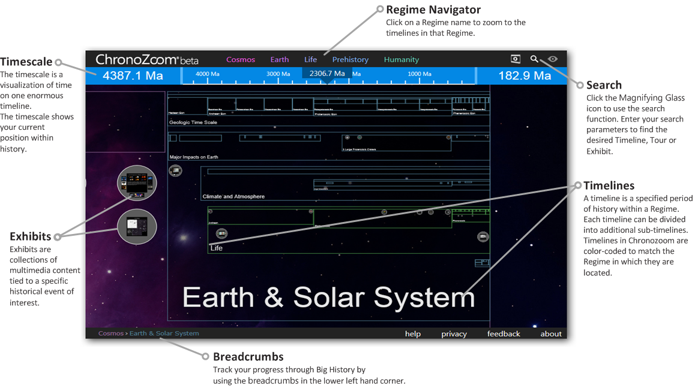
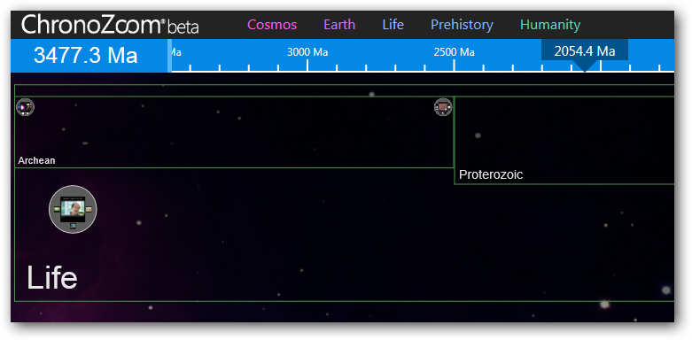
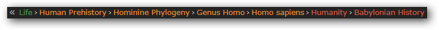
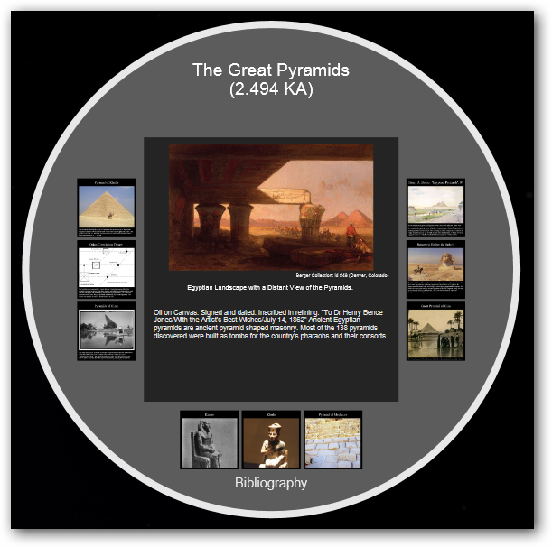
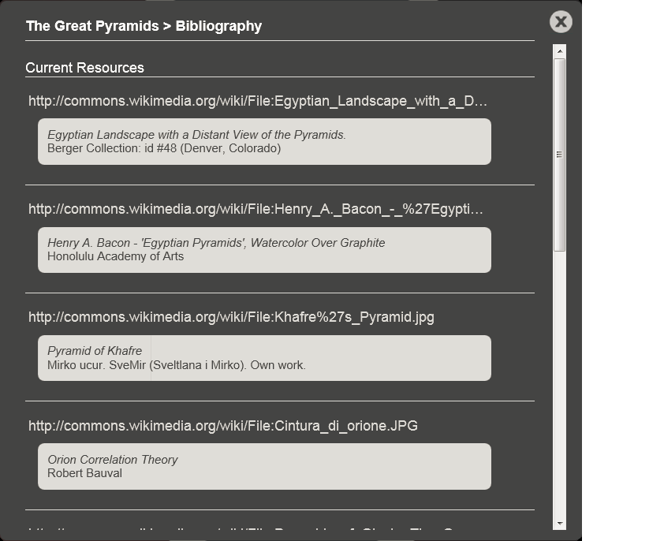

# ChronoZoom User Guide #

**Contents**

- [Introduction](#introduction)
- [Quick Start](#quick-start)
- [ChronoZoom Controls](#chronozoom-controls)
- [Regimes](#regimes)
- [Timelines](#timelines)
- [Breadcrumbs](#breadcrumbs)
- [Thresholds](#thresholds)
- [Exhibits](#exhibits)
- [Bibliography](#bibliography)

<a id="introduction" />
## Introduction ##
ChronoZoom is an intuitive online time visualization tool that uses the concept of zooming to express the scope of time. With ChronoZoom, you can zoom from a timeline that covers decades to one that covers billions of years. This is something that a timeline drawn on paper could never do! Zooming makes it possible to view Big History in a whole new way. You can browse through history on ChronoZoom, and explore an array of historical data including articles, images, video and audio. ChronoZoom's timelines, exhibits and tours have been created by authors from a wide range of disciplines, and express unique and compelling views of history.

The way ChronoZoom interprets time might seem a little strange at first. There is a general tendency to think of time sequentially and expressed solely in linear terms, but using only dates can hide the magnificent scope of the breadth of time. For example, merely reading that the Big Bang occurred 13.7 billion years ago does not convey how vast that length of time actually is. When you use ChronoZoom to zoom from the Industrial Revolution all the way back to the Big Bang, you can see how depth provides an entirely new way to visualize time.

<a id="quick-start" />
## Quick Start ##
If you're eager to dive in to ChronoZoom right now, try these things:

- Take a [Guided Tour](http://www.chronozoomproject.org/#/t00000000-0000-0000-0000-000000000000/t48fbb8a8-7c5d-49c3-83e1-98939ae2ae67/td4809be4-3cf9-4ddd-9703-3ca24e4d3a26/ta6b821df-2a4d-4f0e-baf5-28e47ecb720b/t6f6e6f61-7f0e-4ce0-bafb-8d414da6aa28/tb37f255b-782a-4f61-b134-df1ba6b45819/tbebb7918-64da-4866-894c-1896e01030cf/t4afb5bb6-1544-4416-a949-8c8f473e544d/taff16829-02c1-47c9-9d6b-ebb297a4d89f/t2b415ccb-1f7f-478e-9731-ccc8a72d13fb/tc19439b7-c577-4dc1-9c67-b553b6c7c685/td1e68c6e-e2fa-44e0-91ba-a02feaa74854/tf99eb515-14ef-4560-99eb-b695af4f7041/eccb3e128-b958-4b97-a6b6-b52fb7e93f00/d2d76ba4-1272-45a4-831a-aa11d6f354b2@tour=1).
- Click on the **Humanity** regime and see how zooming really gives you an idea of the  relative sizes of time scales.
- Search for a specific subject, such as Pluto or the Mayan calendar.
- Click and drag to move around within the timelines. Use your mouse wheel to zoom in and out.

<a id="chronozoom-controls" />
## ChronoZoom Controls ##
The following diagram shows ChronoZoom's navigational controls.

<!-- We should definitely link to a PDF Quick Ref card. What is the latest version of that? -->

<a id="regimes" />
## Regimes ##
ChronoZoom links a wealth of information from five major regimes that unify all historical knowledge collectively known as Big History. Big History divides time into five major regimes:

- Cosmos
- Earth
- Life
- Human Pre-History
- Humanity

A Regime covers a specified period of time. Some regimes are vastly larger than others. For example, the Humanity regime covers an infinitesimally small fraction of the time covered by the Cosmos regime.

The Regime Key can be found in the upper portion of ChronoZoom as shown above. Each color represents a specific Regime and this color scheme is followed throughout the timelines inside of each Regime.

By clicking on one of the Regime names, you can zoom to that Regime. ChronoZoom visually moves the screen through every Regime until you hit your target.

<a id="timelines" />
## Timelines ##
A timeline is a specified period of history within a Regime. Each timeline can be divided into additional sub-timelines. Different disciplines, such geology and history, categorize time in different unit and thus some Exhibits (collections of multimedia content tied to a specific historical event of interest) may show up in more than one sub-timeline.

<a id="breadcrumbs" />
## Breadcrumbs ##
ChronoZoom tracks your progress into Big History via the breadcrumbs in the lower left-hand corner of your screen. The term comes from the trail of breadcrumbs left by Hansel and Gretel in the popular fairytale.

Breadcrumbs allow you to track your journey through ChronoZoom. In the example above, the breadcrumbs show that you have zoomed all the way to Babylonian History. Click on a desired Regime or Timeline to zoom in or out to that topic. Click the "<<" and ">>" icons to scroll within the breadcrumb list.

<a id="thresholds" />
## Thresholds ##
<!-- Looks like this has changed in the new UI. Can users still get to thresholds? How are they represented? -->

<a id="exhibits" />
## Exhibits ##
Exhibits are collections of multimedia content tied to a specific historical event of interest. Exhibits might include documents, videos, pictures, and other historical data.

<a id="bibliography" />
## Bibliography ##
A Bibliography is a list of sources for the information in the Exhibit. This is important to verify the accuracy of information and to provide Academic credit to the appropriate individuals. At the bottom of every Exhibit is a click to the Bibliography. Click the link to view the source materials.

Information citing the source and link are provided. In addition, there are websites and journal publications also listed enabling you to conduct deeper research. You can close the Bibliography by clicking the X.

