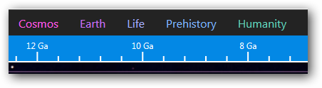

# ChronoZoom User Guide #

- Introduction
- Quick Start
- Regimes
- Timelines
- Breadcrumbs
- 

## Introduction ##
ChronoZoom is an intuitive online time visualization tool that uses the concept of zooming to express the scope of time. You can browse through history on ChronoZoom, and explore an array of historical data including articles, images, video and audio. ChronoZoom's timelines, exhibits and tours have been created by authors from a wide range of disciplines, and express unique and compelling views of history.

The way ChronoZoom interprets time might seem a little strange at first. There is a general tendency to think of time sequentially and expressed solely in linear terms. However, using only dates to chronicle points in time can hide the magnificent scope of the breadth of time. For example, students who read that the Big Bang occurred 13.7 billion years ago may not be able to comprehend how vast that length of time is. When you use ChronoZoom to zoom from the Industrial Revolution all the way back to the Big Bang, you can see how depth provides an entirely new way to visualize time.

## Quick Start ##
If you're eager to dive in to ChronoZoom right now, try these things:
- Click on the **Humanity** regime and see how the act of zooming really gives you an idea of the  relative sizes of time scales.
- Search for a specific subject, such as the planet Pluto or the Mayan calendar.
- Click and drag to move around within the timelines. Use your mouse wheel to zoom in and out.

## ChronoZoom Interface ##
<!-- What is the best way to doc this? -->

<!-- We should definitely link to a PDF Quick Ref card. What is the latest version of that? -->

### Regimes ###
ChronoZoom links a wealth of information from five major regimes that unify all historical knowledge collectively known as Big History. Big History divides time into five major regimes:

- Cosmos
- Earth
- Life
- Human Pre-History
- Humanity

A Regime covers a specified period of time. Some regimes are vastly larger than others. For example, the Humanity regime covers an infinitesimally small fraction of the time covered by the Cosmos regime.

The Regime Key can be found in the upper portion of ChronoZoom as shown above. Each color represents a specific Regime and this color scheme is followed throughout the timelines inside of each Regime.

By clicking on one of the Regime names, you can zoom to that Regime. The lines in the gray box contrast the differences in length of the Regimes and show your current location.

ChronoZoom visually moves the screen through every Regime until you hit your target.

## Timelines ##

A timeline is a specified period of history within a Regime. Each timeline can be divided into additional sub-timelines. Different disciplines, such geology and history, categorize time in different unit and thus some Exhibits (collections of multimedia content tied to a specific historical event of interest) may show up in more than one sub-timeline.

!!! Todo: Add timeline screen capture !!!

## Breadcrumbs ##

