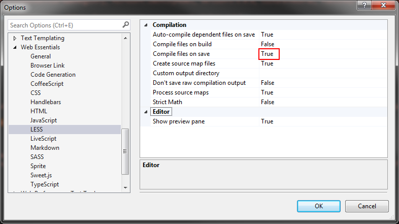
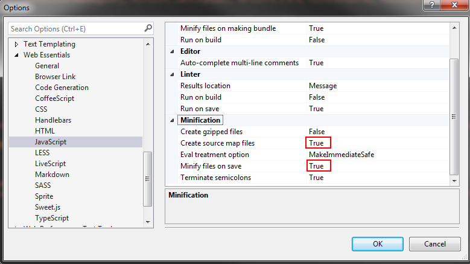
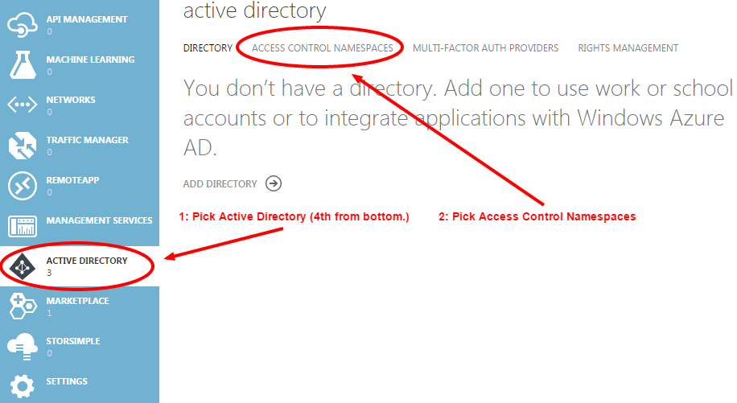
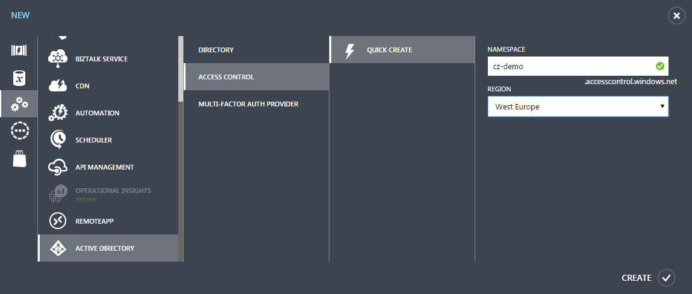
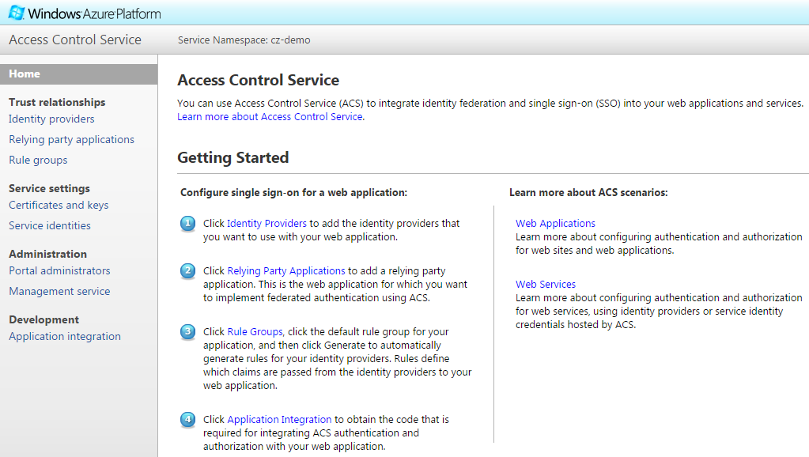
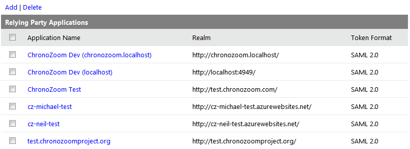
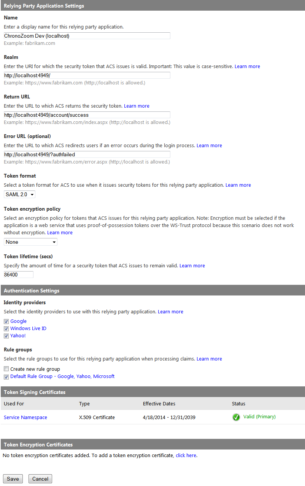

ChronoZoom Installation Guide
==============================

<sup>
Updated 2015 guide for developers, QA and support staff, which supplements, and mostly supersedes, the original 2013 readme.md and original Developer Guide. Some of the major changes to ChronoZoom since 2013 include the removal of TypeScript from the project, and the introduction of an Access Control Service (ACS) to handle log ins. This document reflects these changes.
</sup>

<a name="index"></a>
#### Index
* [Overview & Technology](#intro)
* [Latest Code & GitHub](#git)
* [Visual Studio IDE](#ide)
* [Database Creation](#db)
* [Access Control Service](#acs)
* [Web Server Configuration](#web)
* [Project Documentation](#doc)


<a name="intro"></a>
Overview & Technology
---------------------

ChronoZoom is a zoomable interactive timeline for all of history,
which you can see at [www.chronozoom.com](http://www.chronozoom.com/).

Spending a few minutes on the [Introductory Tour](http://www.chronozoom.com/#@auto-tour=cd44d92d-8af3-4c4e-ab28-bf9a9397ea27) can give a great
overview of why ChronoZoom's zoomable timeline can powerfully
represent the vast expanse of time, and how humanity and recorded
history is such an infinitesimally small part of the chronological clock.

Explore all of the past - from the Big Bang, to the dinosaurs, to ancient
and modern history, or use ChronoZoom to create and share your own
historical collections and content.

The site is open source and built on a Microsoft technology stack utilizing
HTML5, with the interactive timelines using HTML5's canvas, LESS and CSS3,
plus over 20,000 lines of custom object-orientated JavaScript using jQuery,
as a rich single page JavaScript application (SPA) on the web client side.

The server side is written in C# and runs under .NET 4.0 with a thin ASP.NET
MVC page framework, a RESTful JSON API using WCF, a data entity layer, and a
back-end Microsoft SQL Server database. As such, the site is designed to run
on a Microsoft web server (IIS or Azure) and utilizes an Azure Access Control
Service to manage log-ins from Microsoft, Google or Yahoo accounts.

In order to install a working copy of ChronoZoom, for development,
testing or contributing to this open source project, or to run separately
from [www.chronozoom.com](http://www.chronozoom.com), you will need a combination of the following:

<sub>[return to index](#index)</sub>


<a name="git"></a>
Latest ChronoZoom Code Via GitHub
---------------------------------

This can be obtained from https://github.com/alterm4nn/ChronoZoom/.

If you will be contributing to the project, you will need to set up a free
[GitHub account](https://github.com/), or use your existing GitHub account, then fork a copy of
the project. You will then work with your copy, submitting check-ins to your
forked copy on GitHub.

When the changes are ready to be shared/contributed, after ensuring you've
merged in the latest updates from  https://github.com/alterm4nn/ChronoZoom/,
you can submit a "Pull Request" in GitHub from your forked copy, to merge your
changes in to the main open source repository. Please ensure that you have first
tested your work per the Test Tools & Process section shown below.

You will need a Git client tool to manage submission of your changes through
the Git VCS. Some developers prefer to use the free [Github for Windows](http://windows.github.com/) GUI
client, which also installs the command line Git shell. There are plenty of
alternative free Git tools such as [SourceTree](http://www.sourcetreeapp.com/) or Visual Studio plug-ins, which
may also be installed.

One point to keep in mind is that you should never work in the Master branch
in the Git VCS. Instead, create a new branch for each discrete change you want
to work on, and make a pull request for that.

##### The GitHub Process (for Developers new to GitHub)

If contributing code changes, the overall steps involved in working with Git are:

1.  Fork a copy of Alterm4nn's ChronoZoom project in Github. You will then
	have a copy of the code under your account but still up on the GitHub
    web site. Alterm4nn's copy will then be the "**upstream**" or "**remote**"
  	version in GitHub parlance, and your copy would be the "**origin**" version.
 	Forking can be done from the GitHub web site. Just go to Alterm4nn's
	ChronoZoom project and click on the Fork button (top right) after first
    logging in to GitHub.

2.	Clone your copy down to your workstation. This can be from the command
	line, but may be easier done using a tool such as Github for Windows.

3.	From the Master branch on your workstation, create a new branch for the
	changes you'll be making. This is easiest done from the command line. If
    you've not added Git's command tools to your search path then you can use
  	GitHub for Windows and click on the top right cog icon labelled "tools and
 	options" then select "Open in Git Shell". The commands to create a new
	branch then to change your local workspace to the newly created branch are:
    *   `git checkout master` 			(to branch from the master branch)
    * 	`git branch somebranchname` 	(to create the new branch)
    * 	`git checkout somebranchname` 	(to change to the new branch)

4.  You can now go ahead and work on your local copy of the code.

5.	When you're ready to save your changes up on your GitHub account for
    the first time, you can click on the Publish button in GitHub for Windows.
    However, first uncheck web.config as a file to commit as you probably
  	customized that to get a locally running version of ChronoZoom.

6. 	You can use the Synch button to push later updates up to your GitHub a/c.
	As long as you've not made a Pull Request from this branch, your code
    changes only go to your own repository on GitHub, so it's safe to check in
  	unfinished or untested work. If you've made a lot of changes and are still
 	unfinished, you might want to check in each time you've finished a sub-task
	of your work, both as a back-up, and so you can more easily delineate each
    logical part in a different check-in note. This can also be useful too if you
  	use multiple workstations, or want to give a third-party early access so
 	they can also look at, pull or test a work in progress.

7.	Finally you're done, everything tests out OK locally, and you've also tested
	running your changes on an Azure web site with an Azure database. You've
    checked-in the (hopefully) final revision to your GitHub repository. Before you
  	make a pull request, you need to first (on the same day as your pull request)
 	make sure you've updated your local repository and your Github a/c with any
	recent changes from upstream (Alterm4nn's.) These might have been added
    while you were working on your own changes. Generally this is best done from
    Git Shell command prompt you used in step #3:

  	*	First, we'll update your local workspace master from Alterm4nn's upstream.

  		A step-by-step guide is here: https://help.github.com/articles/syncing-a-fork/

    	An alternative approach is:
    	* 	`git checkout master`		(switch to your local master branch)
        * 	`git pull upstream master`	(pull Alterm4nn's master into yours)

    *   You'll then push your updated local master up to your GitHub repository:
    	* `git push origin master`

 	*   Next you'll switch back to the branch you're working on using:
 		* `git checkout somebranchname`

	* 	Then you'll merge what's in your local master into your working branch:
		* `git merge master`

    * 	If you get a change conflict warning then the following may help:
    	* http://softwarecave.org/2014/03/03/git-how-to-resolve-merge-conflicts/
       	* https://help.github.com/articles/resolving-a-merge-conflict-from-the-command-line/

      	You must resolve any conflicts before continuing with any further steps.
     	However if you need help, please reach out to the community.

    *   If there were changes then you must fully retest your work.

    *   Once you're done resolving any changes then you can push what's on your
    	local workstation up to your own repository on GitHub again, via Synch in
   		GitHub for Windows, or from the Git Shell command prompt:
  		* `git push origin somebranchname`

8.	Now we can create the pull request, which is done from your repository on
    the GitHub web site: https://help.github.com/articles/using-pull-requests/

	This will request that Alterm4nn or other ChronoZoom project gatekeepers
    accept the changes you've made in to the ChronoZoom open source project.

    Please note that any further check-ins you make to *somebranchname* in your
    own GitHub repository will now automatically be included as an update to your
    pull request. For this reason, if you have more work to check in that shouldn't yet
    be included in the pull request, then please make a different branch and submit
    a different pull request later. If the pull request is not accepted and you need
    to make some minor changes to fix something first, then you can submit those
    on the original branch so they become a pull request update.

9.	Starting your next contribution:

    When Alterm4nn or other upstream gatekeepers accept your pull request, and
    merge your changes into the main project's master branch, you should repeat
    the steps shown above to pull an updated copy of Alterm4nn's upstream master
    into your local workspace and personal GitHub repository. You should also do this
    before starting a new branch, if you haven't recently (the same day) pulled an
    update from upstream already.

##### Other Helpful Git Resources

Git can have a bit of a learning curve, even if you're used to other VCS.
Here are some other links that may be helpful:
* [Git Cheat Sheet](https://docs.google.com/viewer?url=https%3A%2F%2Fgithub.com%2Fgithub%2Ftraining-materials%2Fblob%2Fmaster%2Fdownloads%2Fgithub-git-cheat-sheet.pdf%3Fraw%3Dtrue) (Recommended)
* [Ensuring Upstream is Set Up](http://blogs.atlassian.com/2013/07/git-upstreams-forks/)
* [GitHub Boot Camp](https://help.github.com/categories/bootcamp/)
* [Online Pro Git Book](http://git-scm.com/book/en/v2)
* [Git Command Reference](http://gitref.org/)
* [Git Command Line Sandbox/Practice](https://try.github.io/)

<sub>[return to index](#index)</sub>


<a name="ide"></a>
Visual Studio IDE
-----------------

Before you can deploy the code to a web server, you will need to use
Microsoft Visual Studio to compile and build a runnable version of the
project. VS2015 hasn't been tested with ChronoZoom so isn't currently
recommended. You will therefore need Visual Studio 2012 or 2013.

Previous requirements to install TypeScript for VS no longer apply, since
TypeScript has been removed from the project.

##### Prerequisites

Make sure your workstation's operating system is fully patched up-to-date.

Please also ensure you have [.NET 4](http://www.microsoft.com/en-us/download/details.aspx?id=17851) or [.NET 4.5](http://www.microsoft.com/en-us/download/details.aspx?id=30653) installed.

If you've installed .NET v4 rather than .NET v4.5 you may also need to
make sure you've installed [Windows Identity Foundation](http://www.microsoft.com/en-us/download/details.aspx?id=17331) too. 

##### Building and Publishing

Before you can build, you will probably need to edit your NuGet settings
in Visual Studio to allow the automatic download of any missing packages
or components. This setting can be found in visual Studio under:
* Tools -> NuGet Package Manager -> Package Manager Settings

An alternative approach can be to right click on the solution in
Visual Studio's Solution Explorer and choose:
* "Enable NuGet Package Restore", or
* "Manage NuGet Packages for Solution".

Please remember to always build before submitting your changes via
GitHub since the build process takes the various individual .js files
written especially for this project, and compiles them into one large,
single custom .js file, which is used in production. (Even if your
development box is set up to use individual .js files.) This composite
file also needs to be included in the check-in.

If adding a new custom JavaScript file to the project, please also edit the
**Merge.cmd** file in the project to include the additional JavaScript file.
This is the file used by the build process to combine all the custom JS.
We do not use bundling since that can have issues with comments at the start
or end of multiple files being concatenated.

If you will be publishing a ChronoZoom web site on Azure, you will not be able
to use the GitHub automated deployment option since some of the custom settings
you need for web.config are in other sections apart from the connection strings
and app setting keys. Instead, you'll need to install and use the [Azure SDK](http://azure.microsoft.com/en-us/downloads/) for
the appropriate version of Visual Studio in order to publish to an Azure web site.

##### Visual Studio 2012
You will likely need at least the Pro version unless you are only coding
in C#, in which case the free Express version should suffice. (Web Essentials,
which we use for JavaScript and LESS, possibly may not installable on the
Express version as Express 2012 does not support non-Microsoft extensions.
This is not a concern in Express 2013.)

Please make sure that you've installed [Visual Studio 2012 Update 4](http://www.microsoft.com/en-us/download/details.aspx?id=39305)
(once you have Visual Studio installed.)

Then, for web work, please install [Web Essentials 2012](https://visualstudiogallery.msdn.microsoft.com/07d54d12-7133-4e15-becb-6f451ea3bea6).
Please note that there is one gotcha bug with this version:
>If you save a LESS file that's imported in the main cz.less,
you also need to make a fake edit to cs.less and save that.
e.g. Add and remove a space. This version of Web Essentials
doesn't seem to chain recompilation of the parent when
child import files are changed.

##### Visual Studio 2013

You can install the free [Microsoft Visual Studio 2013 Express](http://www.visualstudio.com/en-us/products/visual-studio-express-vs.aspx),
or use a paid version if you already have that installed.

Please make sure that you've installed [Visual Studio 2013 Update 4](http://www.microsoft.com/en-us/download/details.aspx?id=44921)
(once you have Visual Studio installed.)

Then, for web work, please install [Web Essential 2013 for Update 4](https://visualstudiogallery.msdn.microsoft.com/56633663-6799-41d7-9df7-0f2a504ca361).

##### ASP.NET MVC

Once Visual Studio is installed, and your system is up-do-date with 
all important patches, you will need to [install ASP.NET MVC 4](http://www.asp.net/mvc/mvc4) too, 
if it isn't already present.

After ASP.NET MVC 4 install please check and install new updates that should appear in 
Windows Update - they are essential for project to run. 

##### Configuring Web Essentials

Please find the Web Essentials section under the Tools -> Options Menu
in Visual Studio and edit so that:

* LESS files are automatically compiled each time you save an edit:

  

* JS Files are automatically minified, and mapped:

  

<sub>[return to index](#index)</sub>


<a name="db"></a>
Database Creation
-----------------

ChronoZoom requires Microsoft SQL Server 2012 or SQL Server 2014,
which can be workstation/server installed, or a version hosted on Azure.

##### Why Developers Typically Need Both a Local and Azure Db

Developers will want to create both a local database, and, in addition,
a database on Azure. The local database has some advantages for the
developer for day-to-day coding over Azure:

* 	It's much faster, since it's local.

* 	It's easier to use from SQL Server Management Studio.
	For example, you can right click on a table and pick a
    menu option to view or edit the top 200 records in a grid.
    Although you can connect to an Azure database from the
    Management Studio, you will have to write your own SQL
	script to do anything, including view records, edit
    records, or change the schema.

An Azure database is still required for testing before checking-in as
www.chronozoom.com uses Azure, as do universities and museums
running their own version of ChronoZoom, and there are some minor
but significant differences around syntax, where Azure is less
forgiving. Code may run fine locally but is not publishable at all
or has bugs on Azure.

Differences for Azure include the following, which are examples
that ChronoZoom developers have encountered:

* 	You will need to use the full `WITH (NOLOCK)` locking hint
    syntax (if you use it) rather than just `(NOLOCK)`.

*   You can't specify a partition in your scripts.
	(This makes sense for a cloud based solution.)

*   Most SP sprocs that are built-in to other editions aren't
	available on the Azure platform.

##### Installing Stand-Alone SQL Server (on Your Workstation)

ChronoZoom be can run with the [free Express edition of SQL Server](http://www.microsoft.com/en-us/download/details.aspx?id=42299/),
or the developer, standard and enterprise editions. Whichever version
is installed, please ensure you patch to the very latest service pack
for SQL Server once you've rebooted your workstation/server after
installing.

You also have the option of using the LocalDb version of SQL Server,
which lets you use a specified file as the database, but doesn't
provide the management tools.

Use of SQL Server Compact Edition (CE) has been deprecated in the
ChronoZoom project due to the larger number of syntax differences
between this edition and others.

##### Installing SQL Server on Azure

There are no particular requirements for ChronoZoom so pick
whichever options are most appropriate to your circumstances, such
as hosting in a geographic region close to where you or the largest
portion of your users reside.

##### Creating and Populating a New ChronoZoom Database

All you need to do is create an empty database with any name you
like. You'll then set up a connection string called "Storage" in
web.config to point to your newly created database. An alternative,
if running an Azure web site, is to leave out the connection string
from web.config and instead place the value in Azure's web site
configuration panel. This is a safer option so that your connection
string isn't checked-in.

For simple cases, when you don't have to deal with server-side,
you can use localdb. Although you have to created ChronoZoom.mdf file 
by yourself: open server explorer in Visual Studio, right-click on
Data Connections and choose Add Connection. Browse for 
Chronozoom.UI/App_Data folder, enter filename ChronoZoom and it will
create file for you.

When the ChronoZoom web site is started, and it connects to the
database, it will see there is no schema and will create the schema
for you, then populate the database with two collections. One of
these collections is a copy of ChronoZoom's Cosmos ("Big History")
collection from December 2014, including the Introductory Tour,
which you can see at www.chronozoom.com.

You can find some example connection strings in web.config, or
you can consult www.connectionstrings.com.

##### Customizing the Featured Content Tiles

Because you will only have one of the collections that appears in
the Featured Content tiles in any newly created database, only the
first two features content tiles (that link to the Cosmos
collection) will work. You can edit your web config to point to
a different list of featured items if this is the case.
(Only necessary if your instance of the database is for
production use.) See the FeaturedContentListLocation appKey
setting, which points to a JSON file that provides a static list
of featured items. (Their titles, and URLs, etc.)

##### Resetting a ChronoZoom Database

If you need to "reset" your database later, to zap all of its
contents, you can either delete and then create a new empty
database, (recommended except on Azure,) and restart ChronoZoom,
or you can run the following SQL script against your Azure db:
* Chronozoom.Entities\SQL\UtilityScripts\DropTablesAzure.sql

<sub>[return to index](#index)</sub>


<a name="acs"></a>
Access Control Service
----------------------

You only need to set up an ACS if users will be logging in to ChronoZoom.
Logging in lets users create their own content, or edit others (if permitted.)
in addition, users can maintain favorite content bookmarks.

The ACS lets users use their Microsoft, Google, and Yahoo credentials to
log in to ChronoZoom. ChronoZoom does not store or have access to these
credentials. Instead we hand over to the appropriate Microsoft, Google,
or Yahoo site to handle the log in, and then the users are redirected back
to ChronoZoom, once logged in.

	Please note that you temporarily may not be able to set up Google
	log ins with ChronoZoom during February 2015. This issue, which is
	due to Google deprecating the API which we are currently using, is
	actively being worked on. Microsoft and Yahoo log ins are unaffected.

Even if your web site and database are not on Azure, for example if you're
developing on your workstation with the Visual Studio web server running there,
and hitting a local MS SQL Server database also on your workstation, you can
still use the Azure ACS. It is not only for Azure web sites.

To use an ACS with your web site, you need to:
1. Go into the ACS settings in Azure and add your web site.
2. Take some of the information that the ACS then provides and configure
   your web site's web.config with that information.

### Getting Started

The ACS runs on Azure so you will need an Azure account and to log in at https://manage.windowsazure.com first.

Multiple developer and test web sites can all be set up on the same
Azure ACS if desired, but it is recommended that for production sites,
you only have the one site per ACS.

##### Choosing an Existing ACS

* Then highlight the ACS in the list of ACS which appears, and
* Pick the manage button at the bottom of the screen.

<sup>
Please note this differs from managing web sites or databases in Azure in that
you can't just click on the ACS in the list. You need to also use the Manage button,
which is found at the bottom of the screen.
</sup>

##### Creating a New ACS
Use the +New button at the bottom left of the screen, then:

1. 	Select App Services (leftmost pane)
2. 	Select Active Directory (at bottom of next pane to right)
3. 	Select Active Control (next pane to right)
4. 	Select Quick Create (next pane to right)
5.	Give your ACS a subdomain name & pick a hosting region (next pane to right)
6. 	Click on the Create button, at the bottom right.



Once your ACS is created:
* Highlight the new ACS in the list of ACS which appears, and
* Pick the manage button at the bottom of the screen.

<sup>
Please note this differs from managing web sites or databases in Azure in that
you can't just click on the ACS in the list. You need to also use the Manage button,
which is found at the bottom of the screen.
</sup>

### Configuring the ACS

First, edit your web.config file, and search for...
>`cz-nodelete-chronozoom-test.accesscontrol.windows.net`

...and replace that with...
>`xxx.accesscontrol.windows.net`

...where `xxx` is the name of the ACS you'll be using. e.g.
>`cz-demo.accesscontrol.windows.net`

Don't search for just `cz-nodelete-chronozoom-test`.
Search for the entire string.

Next, once you're in the management screens for the ACS, (how to get there
is shown in the preceding section,) then you can click on each of the menu
options on the left to configure each part of the ACS:



You generally shouldn't need to access these menu options unless you want to:
* Service identities
* Portal administrators
* Management service

You should work through the remaining ACS menu options in the following order:

##### Identity Providers

If you're just adding a new site's domain name to any already configured ACS,
you can skip this section.

For a newly created ACS, you'll only have Windows Live ID for Microsoft log ins.

* Use the Add button, select Google, click on Next, make no changes and click on Save.

* Use the Add button, select Yahoo,  click on Next, make no changes and click on Save.

##### Rule Groups

If you're just adding a new site's domain name to any already configured ACS,
you can skip this section.

For a newly created ACS, you won't have a rule group so you need to create one:

1.	Ensure that you've set up your Identity providers first, as shown above.

2.	Pick "Add", and give your new rule group the following name:

	`Default Rule Group - Microsoft, Google, Yahoo`

3.	After saving the name, click on "Generate" to start setting up the rules
	which will go in the group.

	Check all three boxes for:
	* Windows Live ID
	* Google
	* Yahoo

	Then hit "Generate" again to perform the actual rule generation.

	None of the then generated rules need to be customized.

##### Certificates and Keys

If this is a newly created ACS, you'll already have the certificates and
keys set up, which should be good for a year.

If this is an existing ACS, it's worth doing a quick check to make sure that the
certificates won't be expiring soon, and if they are, renew them. That process is
outside of the scope of this document, but you can always fall back to a new ACS.

Pick the X.509 certificate and copy the thumbprint GUID from the detail page.
Then, paste this into the two `thumbprint=""` locations in your web.config file.

##### Relying Party Applications

Each web site that uses the ACS needs to be added here.
If say a dev/test web site at **http://localhost:4949/** is set up here already,
you don't need to add it a second time. However, if you have a different
protocol, domain or port for your web site, say **http://localhost/**, that isn't
in the list of relying party applications yet then you need to add it.



You can either "Add" a new relying party application, or
pick an existing one to edit its settings.

Here are the settings from an existing relying party application:



If adding a new relying party application, select "**Enter settings manually**".

You should make all your settings identical to the above, except for changing
the domain name (and port if necessary.) For example, you might use:
'http://www.mywebsitedomain.com/account/success' rather than
'http://localhost:4949/account/success'.

Please remember to uncheck Create new rule group and check the default rule group.
You should also check all of the identity providers, and use the existing service
namespace certificate. Set up the identity providers and rules first.

Before saving relying party application changes, copy the value for the Realm field.
Find the current **realm="somevalue"** entry in web.config and make sure that it is the
same value (but surrounded by quotes.) e.g.
>`realm="http://localhost:4949/"`

You should also make sure this value is added to the list of audienceUris in web.config:
```
<audienceUris>
	<add value="http://www.chronozoom.com/"  />
	<add value="http://test.chronozoom.com/" />
	<add value="http://localhost:4949/"      />
</audienceUris>
```

##### Application Integration

You will need to have finished configuring the relying party application section first.
Once this is completed, you can use Application integration to obtain three connection
strings which need to be placed in web.config.

1.	Select "Login Pages".

2.	Select the relying party application you've just created from the list provided.

3.	Select "Download Example Login Page" and save the file on your workstation.

4.  Open the file using Google Chrome. (We won't be able to use IE for this part.)

5.  Hit F12 to bring up the Chrome developer tools, and then click on "Sources".

6.  Expand the accesscontrol.windows.net tree to get to IdentityProviders.js.

7.  Click on IdentityProviders.js to see the contents of this JavaScript file.
	(Directly opening this URL doesn't work.)

8.  Copy the contents (a compressed JSON string) on to your clipboard.

9.	Paste the contents into an editor that has a tool for formatting JSON.
	There are JSON formatting plugins for most IDEs, including Visual Studio,
    or you can use an online service such as [JSONLint](http://jsonlint.com/).

	An alternative, free, very fast edit tool is [Notepad++](http://notepad-plus-plus.org/), which once
	installed, has a plugin called "JSON Viewer" which can be added via
	Notepad++'s plugin manager.

10.	Highlight the pasted text and format so it is laid out with indentations, etc.
	(Plugins -> JSON Viewer -> Format JSON  - if you're using Notepad++.)

11.	Copy and paste the following thee LoginUrl strings from the formatted JSON
	into the appSettings keys in your web.config file:
	* The Windows Live entry becomes the SignInUrlMicrosoft key's value.
	* The Google entry becomes the SignInUrlGoogle key's value.
	* The Yahoo! entry becomes the SignInUrlYahoo key's value.

12.	If web.config has a build error resulting from pasting these three strings,
	check if you need to further edit these string to replace `&` with `&amp;`.

For better security, if the web.config file is for use on Azure,
you don't need to save any appSettings keys in web.config. Instead,
you can enter them into the web site's Azure control panel,
where they will override appSetting keys found in web.config.

<sub>[return to index](#index)</sub>


<a name="web"></a>
Web Server Configuration
------------------------

##### Why Developers Need to Publish to Azure

During development, you can use the web server that comes with
Visual Studio via F5, so you don't need to keep on publishing
to a web site, (a slow process,) every time you make substantial
client-side edits. You can edit some LESS, HTML, JavaScript,
or JSON files in Visual Studio and save the changes, then just 
refresh your browser to quickly see the results.

For this reason, developers typically don't publish until they
are ready to do final unit testing. Although you can publish
to an IIS server, (it needn't be Azure,) which will help you
find any files you may have forgotten to add to the project,
you must publish to an Azure web site since Azure is less
forgiving than Visual Studio's web server or IIS.

For example, the following C# code will stop you from being
able to publish your web site on Azure at all, (the publish
process will abort,) since the name of the parameter in the
triple slash comment does not match the actual parameter name
in the code:
```
/// <param name="collection">missing parameter indicates current collection</param>
public string GetTours(Guid collectionId)
```

This issue does not occur when publishing to say a local IIS
web server. The only way to find it is to test on Azure, and
any code submitted must be runnable on Azure since
www.chronozoom.com runs on Azure, as do other versions
of ChronoZoom at several universities or museums.

##### Why You Can't Directly Publish from GitHub

Azure has a wonderful option to directly publish from GitHub
to your web site, which can conveniently monitor for check-in
changes. You then go to an Azure web site management panel and
set your web.config database connection string and app keys
there, since you don't want to have passwords and other
confidential information checked into GitHub, where it is
visible to everyone. (ChronoZoom forks are publicly readable.)

Unfortunately there are a couple of extra web config settings
needed relating to the Access Control Service configuration,
which are not app keys, so you will not be able to publish
from GitHub, (as there are no Azure management panel
configuration options for other parts of web.config,) unless
you don't care about users logging in to ChronoZoom. If
that is the case then you can publish from GitHub.

These extra settings are detailed under the [ACS section](#acs)
of this document.

### Connection Strings and AppKeys

These are found in web.config, but if running under Azure, these
can be directly entered into the Azure site's management console,
on the Configuration tab. If running elsewhere, they need to go
in web.config or a derivative.

Example connection strings are in web.config as comments, or
you can consult www.connectionstrings.com for additional help.

The key configurable AppKeys can be changed as follows:

##### FeaturedContentListLocation

*Default value="/featured/featured.json"*

If you're making ChronoZoom available to users on a site other
than www.chronozoom.com, then you need to change this to
point to a different JSON file that contains a list of the
items you'd like to feature on your own site. Use the existing
default list as an example of how to structure your JSON file.

##### UseMergedJavaScriptFiles
Whether or not custom JavaScript is loaded in the client as
individual files or combined into one large file. For development,
the former is preferable, making it easier to find code. For
production (and therefore QA too) the later is preferable as it is
faster to load the code as a single file.

##### UseMinifiedJavaScriptFiles
Whether or not custom JavaScript is minified in the client, which creates
much shorter but highly unreadable JavaScript files. For development,
the former is obviously preferable, For production (and therefore QA too)
the later is preferable as it is faster to load shorter code.

##### FederationMetadataLocation
Only required if users will log in to your site.
Please see the [Access Control Service](#acs) section for configuration details.

##### SignInUrlMicrosoft
Only required if users will log in to your site with Microsoft credentials.
See the [ACS](#acs) section for configuration details.

##### SignInUrlGoogle
Only required if users will log in to your site with Google credentials.
See the [ACS](#acs) section for configuration details.

##### SignInUrlYahoo
Only required if users will log in to your site with Yahoo credentials.
See the [ACS](#acs) section for configuration details.

##### AzureMarketplaceAccountKey

This option only needs configuring if users will be logging in to ChronoZoom.

When logged in ChronoZoom users add content, they have the option of using
Bing to perform a search for an image. In order to use Bing's API, you'll need
an Azure Marketplace Account Key. This is free for up to 5,000 searches
per month, so developers should each be able to set up their own key.

To obtain a free or paid Azure Marketplace account key:

1. Log in to the [Windows Azure Marketplace](https://datamarket.azure.com/).
2. Subscribe to the [Bing search API](https://datamarket.azure.com/dataset/bing/search).
3. Go to the [Account Keys](https://datamarket.azure.com/account/keys) in your account.
4. Create a new Account Key just for ChronoZoom, and use that as the value.

You should never share the default key, which is why you create a new one and
use that with ChronoZoom instead. If your key is compromised, (why you don't
want to check-in web.config edits,) then you can create another new one, start
using that, and delete the old one that is specifically for ChronoZoom. The
reason you don't use the default key is that it can never be changed or deleted.

##### OneDriveClientID

This option only needs configuring if users will be logging in to ChronoZoom
and will be using OneDrive. It is recommended that developers only set this
up for local development if they have some specific OneDrive work to implement.

When logged in ChronoZoom users add content, they have the option of using
their OneDrive account to select an image or audio file that they've stored
there, to be used in some new content.

In order to use OneDrive in ChronoZoom, you'll need to [register your web
site application to use the OneDrive SDK](https://msdn.microsoft.com/en-us/library/dn659751.aspx).

Each domain name would have it's own registration. You can then review
the [list of application keys](https://account.live.com/developers/applications/index), and select the appropriate value to use.

There is one catch that can be particularly troublesome for local development,
if you want to use/test OneDrive interaction: You need to set up the Redirect
URL in the registration created above to point to the domain of your web site,
which for local development work is typically http://localhost:4949. However,
the web screens at live.com where you create/edit your entry will NOT allow:

1. "localhost" as the domain name. A dot is required such as "cz.localhost".
2. A port to be specified. Port 80 (via http) or 443 (via https) is assumed.

This in turn means that you have to change your Visual Studio project to
use a different domain name than localhost, and to use port 80 instead of
another port when locally running in debug mode. This is easier to do in
Visual Studio 2012 but requires some workarounds for Visual Studio 2013, plus
you need to ensure that if you use IIS, that it either does not use port 80
on 127.0.0.1 or you stop the IIS service first with `net stop w3svc`, meaning
you'll need local admin rights on your development box. Don't forget all the
other changes too such as to the ACS settings and throughout web.config.

We recommend, if you have to do this, to use http://chronozoom.localhost/
instead of http://locahost:4949/.

###### Switching to use chronozoom.localhost:

1. Edit your hosts file to add an entry for chronozoom.localhost.
   Your hosts file is typically located here:

   `c:\windows\system32\drivers\etc\hosts`

   You can't use Notepad since it always appends a .txt to the file name, and
   the file name should just be "hosts". You can use a free editor such as
   [Notepad++](http://notepad-plus-plus.org/) instead to add the following line to the file:

   `127.0.0.1 chronozoom.localhost`

2. For Visual Studio 2012, edit the Chronozoom.UI.csproj file in the project,
   look for `>4949<` and replace that with `>80<`. If you edit your web.config file
   and ACS settings to match the new domain and port, you should now be ready to
   use http://chroozoom.localhost/.

3. For Visual Studio 2013, you'll need to do the same as VS2012 shown in step 2,
   but additionally edit the appropriate lines in your csproj file as follows:

   ```
   <UseIISExpress>true</UseIISExpress>
   <UseIIS>True</UseIIS>
   <DevelopmentServerPort>80</DevelopmentServerPort>
   <IISUrl>http://chronozoom.localhost:80/</IISUrl>
   ```

   You'll also need to edit your IIS Express configuration file. Do this first
   if you are using the Visual Studio menus to edit your csproj file rather 
   than with a text editor. Your IIS Express file is located beneath your
   My Documents folder:

   `My Documents \ IISExpress \ config \ applicationhost.config`

   Look for the `<sites>` section and add something like the following,
   adjusting the site id # as appropriate, or edit the existing site entry
   if you previously used IIS Express for ChronoZoom:

	```
    <site name="Chronozoom.UI" id="2">
        <application path="/" applicationPool="Clr4IntegratedAppPool">
            <virtualDirectory path="/" physicalPath="C:\Work\ChronoZoom\ChronoZoom\Source\Chronozoom.UI" />
        </application>
        <bindings>
            <binding protocol="http" bindingInformation="*:80:chronozoom.localhost" />
        </bindings>
    </site>
	```
   The physical path should match the path you set up on your PC for the
   Chronozoom.UI project code.

##### AnalyticsServiceId

If you have a Google Analytics account set up for your ChronoZoom web site
then you can enter the id here. You should only do so if this is a production
web site you're configuring, not a development or test web site. You can then
use Google Analytics to track how many visitors and page view you have, etc.

If you're running your web site on Azure, then there are also options on the
Azure management console web pages that let you monitor and track your site's

##### Airbrake Keys

If you have a [paid Airbreak account](https://airbrake.io/pages/home/), then you can set these up in order
to log errors in JavaScript or C# in this logging service. This can be
convenient with a production site to see what is going on but less so
on a development site.

>To track C# errors, set **Airbrake.TrackServer** to true.

>To track JS errors, set **Airbrake.TrackClient** to true.

Set both the above to false if you do not have a paid Airbrake account
or don't want to use it.

>To identify which server/environment is reporting an error, set
 **Airbrake.Environment** to an appropriate value. e.g. "production".

##### SearchEngineIndexing
This should remain false unless you want search services such as Bing
or Google to index your site's contents, which should only be on a 
production system, not on QA or development.

##### Possibly Defunct AppKeys
It appears that the following are no longer used and can
likely be removed from the project:
* ClientValidationEnabled
* UnobtrusiveJavaScriptEnabled

<sub>[return to index](#index)</sub>


<a name="doc"></a>
Project Documentation
---------------------

To edit the .md files in the GitHub project, which provide documentation
such as the guide you're currently reading, you'll need to use a [Markdown](http://en.wikipedia.org/wiki/Markdown)
editor that supports the GitHub flavor of Markdown. Trello, the project/task
management system we use for ChronoZoom, also uses generic Markdown.

There are plenty of free Markdown editors available, including some for IDEs
such as Visual Studio, WebStorm or Sublime Text. However, many of these IDE
editors, although they support generic Markdown formatting, are not so great
at catering for GitHub.

This particular guide was initially created using [Haroopad](http://pad.haroopress.com/), a free
stand-alone Markdown editor available for a wide-range of platforms.
[MarkdownPad](http://markdownpad.com/) is also a popular choice, but only the paid Pro version
supports GitHub's Markdown syntax.

In a pinch you can use any plain text editor instead for minor editing,
but seeing a preview of the formatted Markdown output as you type is
invaluable, plus a lot of the editors provide a buttons you can click on,
after highlighting some text, to format it in a particular way with Markdown.
e.g. Change some text into a title.

For help with using Markdown in general, here are some quick guides:
* [3 Minute Markdown Tutorial](https://guides.github.com/features/mastering-markdown/)
* [Markdown Basics](https://help.github.com/articles/markdown-basics/)
* [GitHub Flavored Markdown](https://help.github.com/articles/github-flavored-markdown/)
* [Markdown Cheatsheet](https://github.com/adam-p/markdown-here/wiki/Markdown-Cheatsheet)

<sub>[return to index](#index)</sub>
